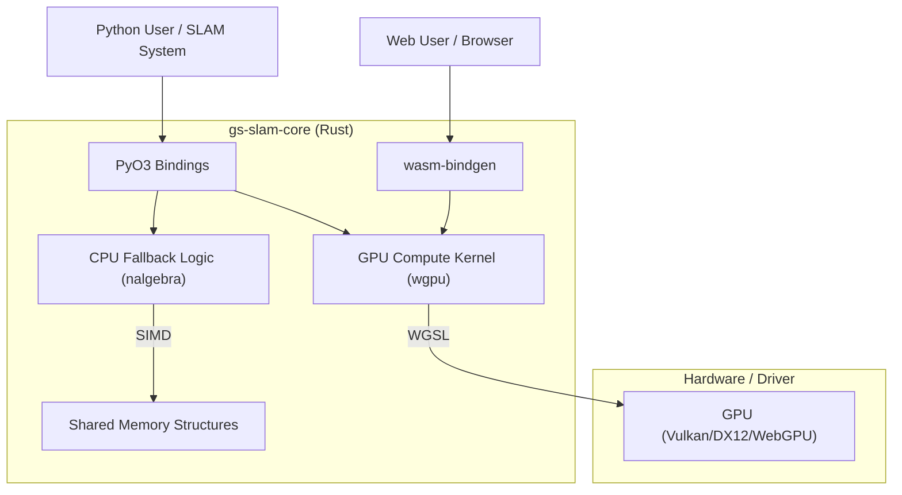

# gs-slam-core: High-Performance 3DGS Compute Kernel

**Version:** 0.1.0

**Architecture:** Dual-Runtime (Python Native / WebAssembly)

**Backend:** wgpu (Vulkan / DirectX 12 / Metal / WebGL2)

## 1. Executive Summary

**gs-slam-core** は、3D Gaussian Splatting (3DGS) データのための高性能な計算カーネルです。Rust言語によって実装され、**「解析・SLAM統合のためのPythonモジュール」**と**「ブラウザでの可視化のためのWebAssembly (WASM)」**という2つの異なるランタイムに対して、同一のコアロジックとGPUコンピュート機能を提供します。

本システムは、以下の課題を解決するために設計されました：

1. **Pythonの計算ボトルネック解消**: 数万〜数百万のガウシアンに対する幾何学計算（法線推定、色復元）をGPU並列処理で実行。
2. **クロスプラットフォーム可視化**: 高価なワークステーションだけでなく、ブラウザ（WebGPU）を通じてどこでも3DGSデータを閲覧可能にする。
3. **環境依存性の排除**: WSL2等の仮想環境におけるGPUドライバの不安定さに対し、堅牢なCPUフォールバック機構を備える。

---

## 2. System Architecture

本システムは `wgpu` クレートを中心に構築されており、GPUリソース（バッファ、シェーダー）の管理をRustが一元管理します。



### 2.1 Feature Flags

ビルドターゲットに応じて、`Cargo.toml` の機能フラグで依存関係を最小化します。

* **`features = ["python"]`**: `pyo3` を有効化し、Python拡張モジュール (`.so` / `.pyd`) をビルド。
* **`features = ["wasm"]`**: `wasm-bindgen`, `web-sys` を有効化し、WASMバイナリをビルド。DOM操作イベントリスナーを含む。

---

## 3. Memory Layout & Data Structures

GPU (WebGPU/WGSL) と CPU (Rust) 間でゼロコピーに近いデータ転送を行うため、データ構造は **std140 / std430 メモリレイアウト（16バイトアライメント）** に厳密準拠しています。

### 3.1 Input: Gaussian Splat

学習済みのPLYファイルから読み込まれるデータ構造です。
**Stride: 64 bytes** (16 bytes  4 vectors)

| Offset | Field Name | Rust Type | WGSL Type | Description |
| --- | --- | --- | --- | --- |
| **0** | `pos` | `[f32; 3]` | `vec3<f32>` | 位置座標 (X, Y, Z) |
| **12** | `opacity` | `f32` | `f32` | 不透明度 (Sigmoid適用前/後など実装依存) |
| **16** | `scale` | `[f32; 3]` | `vec3<f32>` | スケール (Log空間またはExp後) |
| **28** | `_pad1` | `f32` | `f32` | **Padding** (アライメント調整用) |
| **32** | `rot` | `[f32; 4]` | `vec4<f32>` | 回転クォータニオン (x, y, z, w) |
| **48** | `sh_dc` | `[f32; 3]` | `vec3<f32>` | 球面調和関数 0次項 (RGBの元データ) |
| **60** | `_pad2` | `f32` | `f32` | **Padding** (アライメント調整用) |

### 3.2 Output: Surfel (Surface Element)

計算シェーダーが出力し、レンダリングパイプラインが描画に使用する構造体です。
**Stride: 48 bytes** (16 bytes  3 vectors)

| Offset | Field Name | Rust Type | WGSL Type | Description |
| --- | --- | --- | --- | --- |
| **0** | `pos` | `[f32; 3]` | `vec3<f32>` | 入力と同じ位置座標 |
| **12** | `_pad0` | `f32` | `f32` | Padding |
| **16** | `color` | `[f32; 3]` | `vec3<f32>` | SHから復元されたRGBカラー (0.0 - 1.0) |
| **28** | `_pad1` | `f32` | `f32` | Padding |
| **32** | `normal` | `[f32; 3]` | `vec3<f32>` | 推定された法線ベクトル (正規化済み) |
| **44** | `_pad2` | `f32` | `f32` | Padding |

---

## 4. Algorithms

### 4.1 Spherical Harmonics Decoding

3DGSのSH係数（0次項）からRGBカラーを復元します。


* 定数 

### 4.2 Normal Estimation

3D Gaussianは楕円体ですが、SLAMやサーフェス再構築においては「平面（Surfel）」として扱うことが有用です。本システムでは、楕円体の「最も平らな面」を法線として定義します。

1. **クォータニオンの正規化**: 入力 `rot` を正規化。
2. **回転行列への変換**: クォータニオン  から回転行列  を構築。
3. **最小スケール軸の特定**: スケールベクトル  の各成分の絶対値を比較し、最小となる軸（ローカル座標系の  のいずれか）を特定する。これをローカル法線  とする。
4. **ワールド座標変換**: 

---

## 5. Usage Guide: Python Module

SLAMシステムやデータ解析パイプライン向けの利用方法です。

### 5.1 Installation

```bash
# 仮想環境内で実行
uv pip install maturin
maturin develop --release --features python

```

### 5.2 API Reference (`gs_slam_core.SplatManager`)

```python
import gs_slam_core

# 1. PLYファイルのロード
# メモリマップを使用して高速にパースします。
manager = gs_slam_core.SplatManager("data/point_cloud.ply")
print(f"Count: {manager.count()}")

# 2. 幾何情報の計算 (GPU)
# 計算シェーダーを実行し、法線と色を算出します。
# 戻り値: 計算されたSurfelの数
try:
    count = manager.compute_geometry()
except Exception as e:
    print(f"GPU Error: {e}")
    # WSL2などでGPUが利用できない場合のフォールバック
    count = manager.compute_geometry_cpu()

# 3. データアクセス (Zero-Copy Accessor)
# 計算結果の確認（インデックス指定）
normal = manager.get_surfel_normal(0)  # [nx, ny, nz]
color = manager.get_surfel_color(0)    # [r, g, b]

# 元データの確認
pos = manager.get_splat_pos(0)

```

---

## 6. Usage Guide: Web Visualization

ブラウザ上で動作する高性能ビューアの利用方法です。

### 6.1 Build & Run

```bash
# 1. WASMビルド
wasm-pack build --target web --out-dir www/pkg --no-default-features --features wasm

# 2. サーバー起動
cd www
python -m http.server 8080

```

ブラウザで `http://localhost:8080` にアクセスします。

### 6.2 UI Controls

* **File Input**: `.ply` ファイルをドラッグ＆ドロップまたは選択。
* **Mode Switch**:
* `RGB Color`: SHから復元された色を表示。
* `Normal Map`: 推定された法線ベクトルを色として表示 ()。


* **Mouse Controls**:
* `Left Click + Drag`: 回転 (Orbit)
* `Right Click + Drag`: 平行移動 (Pan)
* `Wheel`: 拡大縮小 (Zoom)


---

## 7. Troubleshooting

### 7.1 WSL2 `Device(Lost)` Error

WSL2上のLinux環境では、Windowsホスト側のGPUドライバとの通信制約により、`wgpu` が `Device(Lost)` エラー（メモリ不足やタイムアウト）を返すことがあります。

**対策:**

1. **Python側**: `try-except` ブロックで `compute_geometry()` を囲み、失敗した場合は `compute_geometry_cpu()` を呼び出すことで処理を継続できます。ロジックは完全に等価です。
2. **Rust側修正**: `wgpu::Limits::downlevel_defaults()` を使用して要求リソースを下げていますが、それでも発生する場合は環境依存です。

### 7.2 表示がおかしい・真っ黒になる

* **原因**: データのアライメント不一致が最大の原因です。
* **確認**: `src/lib.rs` の構造体定義と `src/shader.wgsl` の構造体定義で、パディング（`_pad`）の位置とサイズが完全に一致しているか確認してください。本リポジトリのコードは `vec4` (16byte) 単位で統一されています。

### 7.3 `nalgebra` import error

* **原因**: `Cargo.toml` の `features` 設定漏れ。
* **対策**: `[dependencies]` に `nalgebra = { ..., optional = true }` を記述し、`[features]` の `python` および `wasm` のリストに `"dep:nalgebra"` を追加してください。